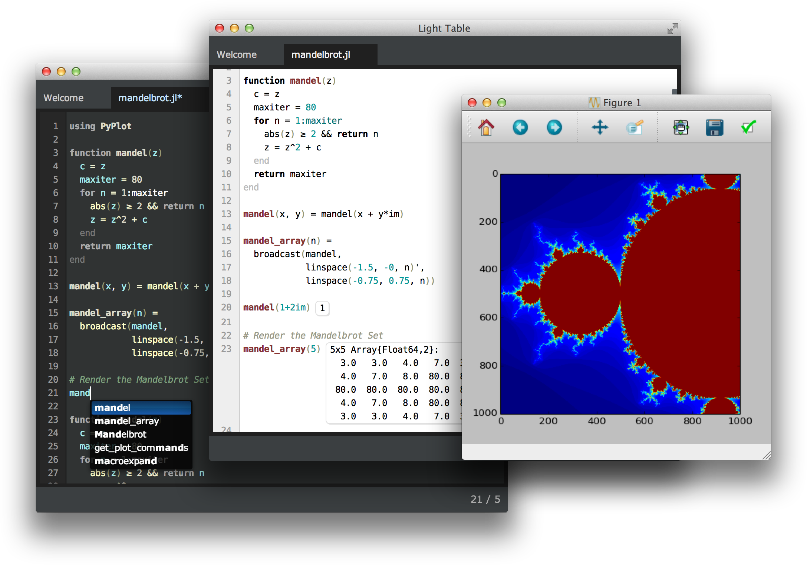

  

Juno is an environment for the Julia language, with strong support for interactive development and a whole load of other niceties, implemented over Light Table.

Please see [the website](http://junolab.org/docs/install.html) for installation instructions and documentation, and the [Julia-LT](https://github.com/one-more-minute/Julia-LT/issues) repo for issues.

Note that the [Julia language plugin](https://github.com/one-more-minute/Julia-LT) provides the core functionailty; this repo is essentially a thin wrapper which exposes that functionality and provides a more convenient set of defaults.

BitCoin: 1KqaY84xFQx6SzghtGSRUPB64cFoxMnaTB
